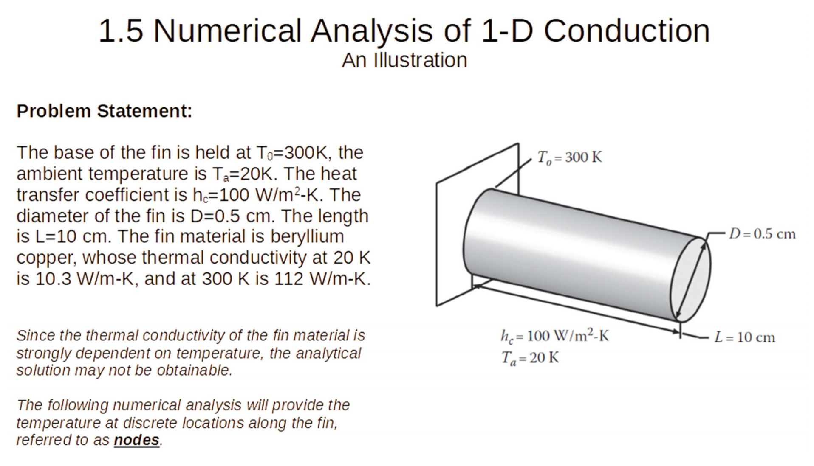

Version: v0.1.1
# 1D Fin Steady-State Heat Conduction Simulation

***This project was developed as an MA6801 course assignment at NTU for Fall 2025 (Semester 1).***

This project simulates the *steady-state temperature distribution on a 1D circular fin* with convection at its surface.  
The fin has temperature-dependent thermal conductivity `k(T)`, using two-point linear interpolation.



---

## Mathematical Model

The fin is modeled by the energy balance at each control volume:

$$
Q_{\text{left}} + Q_{\text{right}} + Q_{\text{conv}} = 0
$$

where:

- Conduction:

$$
Q_{\text{left}} = k \frac{A}{dx}(T_{i-1} - T_i)
$$

$$
Q_{\text{right}} = k \frac{A}{dx}(T_{i+1} - T_i)
$$

- Convection:

$$
Q_{\text{conv}} = h P dx (T_a - T_i)
$$

Thermal conductivity is interpolated from two user-specified points:

$$
k(T) = k_1 + (k_2 - k_1)\frac{T - T_1}{T_2 - T_1}
$$

---

## Installation

```bash
pip install -r requirements.txt
```

---

## Project Structure

The simulation parameters are defined inside `main.py` through the `FinParams` class.  
Below is the default configuration used in this project:

```python
FinParams(
    length=0.1,          # Fin length (m)
    total_node=50,       # Number of grid nodes
    T0=300.0,            # Base temperature (K)
    Ta=20.0,             # Ambient temperature (K)
    hc=100.0,            # Convection coefficient (W/m²·K)
    D=0.005,             # Fin diameter (m)
    error=1e-2,          # Convergence threshold for energy balance
    delta=3e-2,          # Convergence factor
    max_step=100000,     # Maximum iteration steps
    print_step=10000     # Print interval
```
The temperature-dependent thermal conductivity is defined in `FinParams` class:

```python
    kt_slope=(112.0-10.3)/(300.0-20.0)  # Slope dk/dT for thermal conductivity
    kt_bias=10.3-kt_slope*20.0          # Bias for thermal conductivity
)           
```

---

## Usage

The program supports three solvers: `residual`, `picard`, and `newton` (default: residual).

Run the simulation:

```bash
python main.py --solver <solver>
```

Examples:

```bash
python main.py --solver residual
python main.py --solver picard
python main.py --solver newton
```

---
## Expected Output

```
step=5000, max_energy=0.523505, pass=23/50
step=10000, max_energy=0.176659, pass=17/50
step=15000, max_energy=0.078757, pass=15/50
step=20000, max_energy=0.039235, pass=19/50
step=25000, max_energy=0.020725, pass=26/50
step=30000, max_energy=0.011394, pass=39/50
step=35000, max_energy=0.006512, pass=50/50

node 0, x=0.000000 m, T=300.00 K
node 5, x=0.010000 m, T=241.10 K
node 10, x=0.020000 m, T=189.50 K
node 15, x=0.030000 m, T=145.16 K
node 20, x=0.040000 m, T=108.05 K
node 25, x=0.050000 m, T=78.09 K
node 30, x=0.060000 m, T=55.15 K
node 35, x=0.070000 m, T=38.95 K
node 40, x=0.080000 m, T=28.88 K
node 45, x=0.090000 m, T=23.77 K
node 50, x=0.100000 m, T=22.13 K
```